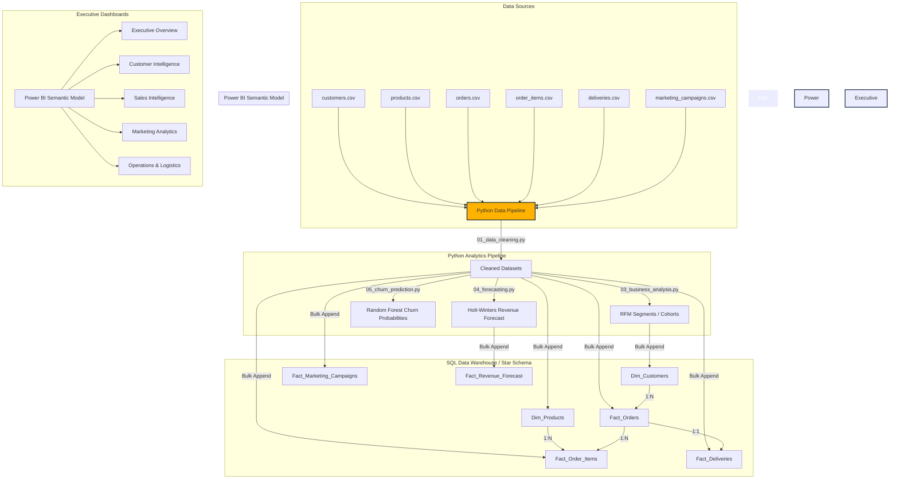

# Power BI Dashboard Architecture & UX Guide
**Company: Daraz Pakistan (E-Commerce)**

This document details the data architecture, data pipelines, visual selection justifications, and advanced interactive design patterns used in the Daraz Pakistan E-Commerce Analytics Dashboard.

---

## 1. Data Flow & Integration Architecture

The following diagram illustrates the data ingestion, modeling, and dashboard delivery layers:

---

## 2. Visual Selection Justification

To ensure the dashboard is executive-ready and drives immediate business decisions, visuals were selected based on information density and cognitive load principles:

*   **Holt-Winters Line + Forecast Combo (Page 1)**: Combining historical monthly GMV with a 6-month forecasting model in a single trend chart allows executives to immediately evaluate if current momentum is aligned with seasonal targets (e.g. Ramzan, Blessed Friday).
*   **Choropleth Regional Map (Page 1)**: Using a localized Pakistan map with color-scaled density by province instantly identifies sales geographic distribution, replacing messy table lookups.
*   **RFM Segmentation Horizontal Bar Chart (Page 2)**: Chosen over pie charts to display customer segments. Horizontal bars allow immediate length comparisons and easily accommodate longer labels like "At Risk / Slipping".
*   **Cohort Retention Heatmap (Page 2)**: The conditional color intensity (Blue spectrum) makes it instantly clear at which month customer activity decays (e.g. Month 1 drop-off), allowing marketers to pin-point friction in the onboarding flow.
*   **AI Key Influencers Visual (Page 2)**: Replaces static regression reports. It dynamically queries customer variables and reveals the top drivers of customer churn (e.g. late delivery rate or average rating), powered by built-in machine learning models.
*   **Matrix with Conditional Data Bars (Page 3)**: Combining tabular detail with visual data bars helps managers quickly scan high-revenue items while retaining detail on margins and volumes.
*   **Transit Days vs Satisfaction Scatterplot (Page 5)**: Scatterplots are perfect for identifying correlation. Placing average transit days on the X-axis and customer rating on the Y-axis immediately illustrates the "SLA Cliff" where satisfaction drops off.

---

## 3. UX Design Guidelines

To build a premium visual experience that matches top-tier consulting outputs:

1.  **Strict Color Coding**:
    *   `Dark Navy (#0B1F3A)`: Primary background headers and structural navigation bars. Ensures high visual anchor.
    *   `Soft Gray (#F5F7FA)`: Page canvas background. Minimizes eye strain compared to pure white.
    *   `Emerald Green (#00C853)`: Positive metrics (YoY growth, high delivery ratings, high margins).
    *   `Professional Gold (#FFB300)`: Warning states, targets, and forecasts (such as predicted revenue).
    *   `Alert Red (#E53935)`: Negative indicators (high return rates, checkout failures, churn warnings).
2.  **Typography**: Set font family to **Segoe UI Semibold** or **Arial** across all visuals. Keep sizes structured: Titles (16pt, Bold, Navy), Data Labels (10pt, Regular, Charcoal), KPI Callouts (36pt, Bold, Navy/Green/Red).
3.  **Visual Padding**: Maintain a standard **8px padding** and **8px corner radius** on all visual containers. Grid alignment must be strictly maintained (aligning visual edges).
4.  **No Visual Clutter**: Remove all gridlines, background shading inside visual frames, and default icons where possible. Keep axes titles clean.

---

## 4. Advanced Interactive Features

The dashboard implements several advanced Power BI features:

*   **Time Intelligence Slicers**: Using a Date table linked to the orders table, the user can toggle between Year-to-Date (YTD), Month-to-Date (MTD), and Same Period Last Year (SPLY) dynamically.
*   **Navigation Bookmarks**: Bookmark buttons configured on the left panel allow smooth transition between dashboard pages without cluttering the canvas with tabs.
*   **Hover Tooltips**: Visual tooltips are configured to show additional customer attributes (e.g., hover over Quetta on the map to see its top 3 most delayed items and average shipping fees).
*   **What-If Scenario Parameter**: A slider on Page 2 allows the CMO to adjust the customer retention rate. It dynamically updates the predicted customer base and lifetime value forecasts (CLV).
*   **Drill-through Actions**: Right-clicking on any category on Page 3 allows the user to drill through to a detailed product-level order history report.
*   **Smart Narrative**: Power BI's natural language generation summarises key takeaways dynamically, highlighting outliers and anomalies.
