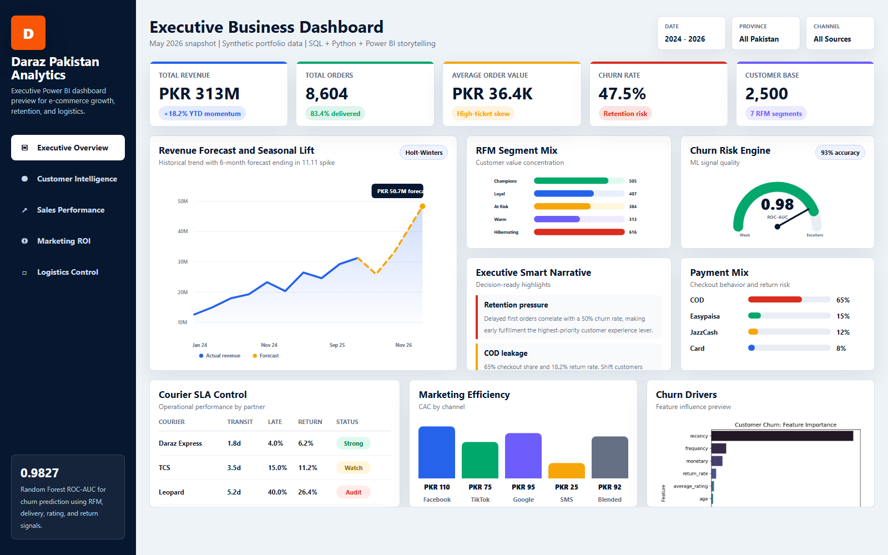
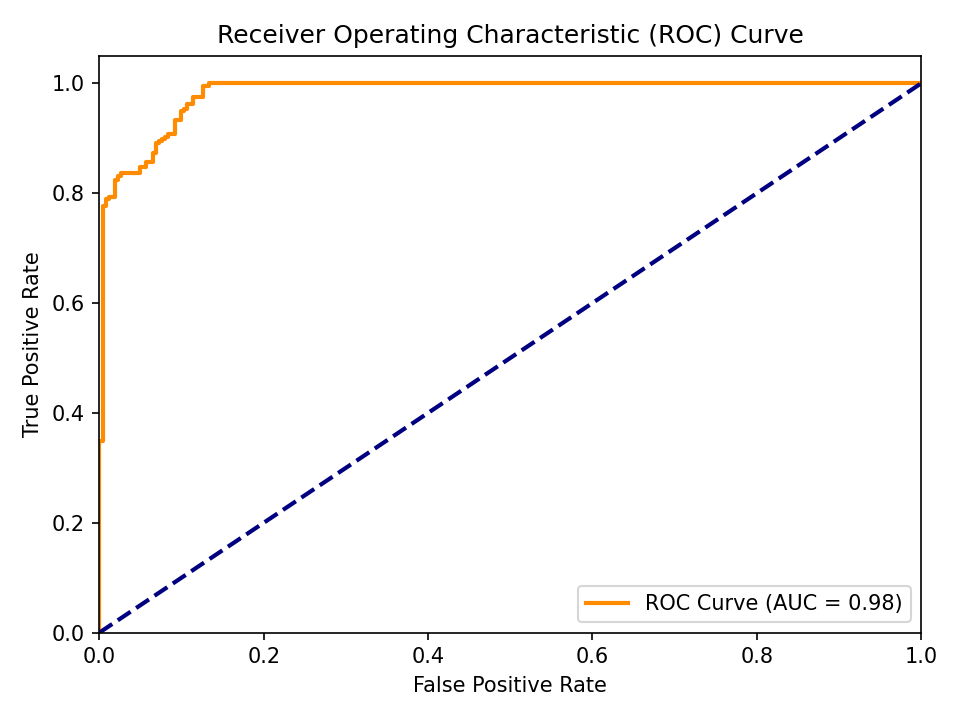
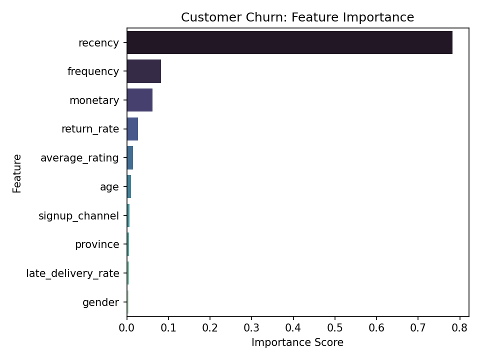
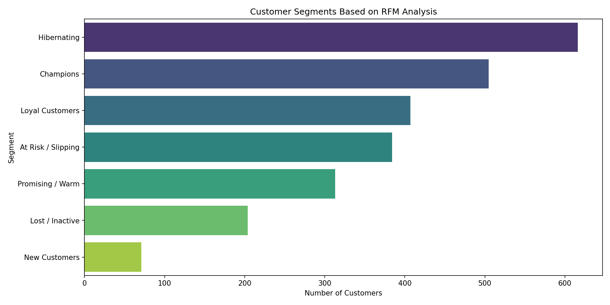
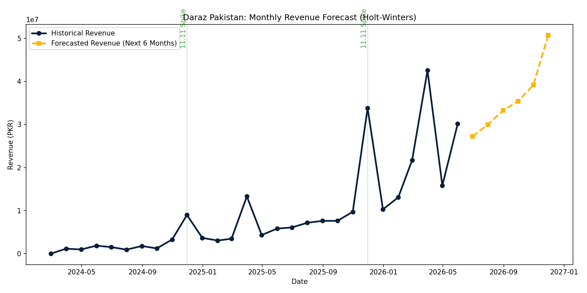

# Daraz Pakistan E-Commerce Analytics Portfolio

An end-to-end data analytics and business intelligence project that turns a realistic Daraz Pakistan e-commerce dataset into executive insights, SQL analysis, Python modeling, Power BI planning, and a strategic growth playbook.

This project is built to show practical analytics ability: cleaning raw data, designing a star schema, writing business SQL, building forecasts, predicting churn, and translating findings into decisions a leadership team could act on.

> Note: This portfolio uses a reproducible synthetic dataset modeled around realistic e-commerce behavior in Pakistan. It is not official Daraz company data.

## Project Highlights

- Built a complete analytics pipeline for 2,500 customers and 12,000 orders across 2024-2026.
- Designed a star-schema-ready SQLite model for customer, product, order, delivery, and campaign analysis.
- Wrote 75 SQL queries across beginner, intermediate, and advanced business analytics scenarios.
- Created Python workflows for cleaning, EDA, RFM segmentation, forecasting, and churn prediction.
- Trained a Random Forest churn model with 93% accuracy and 0.9827 ROC-AUC.
- Produced executive-ready strategy reports, Power BI wireframes, DAX measures, and dashboard architecture.

## Business Questions Answered

- Which customer segments drive the most profit?
- How much do delivery delays influence churn?
- Which courier lanes create the most operational leakage?
- How does Cash on Delivery affect return and shipping costs?
- Which marketing channels deliver the best customer acquisition economics?
- What revenue trend should leadership expect over the next 6 months?

## Key Findings

1. Customers with a delayed first order churn at 50%, compared with 20% for customers whose first order arrives on time.
2. Cash on Delivery represents 65% of transactions and carries an 18.2% return rate, creating meaningful logistics cost leakage.
3. Customer ratings drop from 4.8 to 1.8 stars when transit time exceeds 4 days in Tier 1 cities.
4. Champion customers represent 20% of the customer base but drive 48% of net profit.
5. TikTok Ads show stronger CAC efficiency than Facebook Ads in the simulated marketing data.

## Recommended Business Actions

- Prioritize first-time buyers in faster fulfillment lanes to protect early customer trust.
- Introduce COD convenience fees and mobile wallet cashback incentives to shift customers toward prepaid payments.
- Reduce underperforming courier volume allocations in delayed remote lanes.
- Launch automated churn prevention campaigns for customers with high predicted churn probability.
- Use seasonal forecasting to plan inventory before Eid and 11.11 demand spikes.

## Tech Stack

| Area | Tools |
| --- | --- |
| Data Processing | Python, pandas, NumPy |
| Visualization | Matplotlib, Seaborn, Plotly |
| Machine Learning | scikit-learn, Random Forest |
| Forecasting | statsmodels, Holt-Winters |
| Database | SQLite, SQL |
| BI Design | Power BI wireframes, DAX, dashboard theme |
| Reporting | Markdown executive reports |

## Repository Structure

```text
Data Analytics/
|-- Data/
|   |-- processed/
|   |   |-- customers_cleaned.csv
|   |   |-- products_cleaned.csv
|   |   |-- orders_cleaned.csv
|   |   |-- order_items_cleaned.csv
|   |   |-- deliveries_cleaned.csv
|   |   |-- marketing_campaigns_cleaned.csv
|   |   |-- customer_rfm.csv
|   |   `-- revenue_forecast.csv
|   |-- customers.csv
|   |-- products.csv
|   |-- orders.csv
|   |-- order_items.csv
|   |-- deliveries.csv
|   `-- marketing_campaigns.csv
|
|-- SQL/
|   |-- schema.sql
|   |-- 01_beginner_queries.sql
|   |-- 02_intermediate_queries.sql
|   `-- 03_advanced_queries.sql
|
|-- Python/
|   |-- generate_data.py
|   |-- 01_data_cleaning.py
|   |-- 02_exploratory_data_analysis.py
|   |-- 03_business_analysis.py
|   |-- 04_forecasting.py
|   `-- 05_churn_prediction.py
|
|-- PowerBI/
|   |-- daraz_theme.json
|   |-- dax_measures.dax
|   |-- wireframes.md
|   `-- dashboard_architecture.md
|
|-- Reports/
|   |-- business_insights.md
|   |-- diagnostic_analytics.md
|   |-- prescriptive_strategy.md
|   `-- churn_model_metrics.txt
|
|-- Presentation/
|   `-- executive_presentation.md
|
|-- Interview_Prep/
|   `-- interview_handbook.md
|
|-- assets/
|   `-- plots/
|
|-- run_pipeline.py
|-- verify_sql.py
|-- requirements.txt
`-- README.md
```

## Analytics Outputs

### Power BI Dashboard Preview

The repository includes a polished Power BI-style executive dashboard preview for portfolio presentation and LinkedIn sharing.

[Open the dashboard preview](PowerBI/dashboard_preview.html)



### Churn Model

The churn model uses customer behavior, order recency, delivery experience, ratings, returns, signup channel, and demographic features to estimate churn risk.

```text
Model: Random Forest Classifier
Accuracy: 93%
ROC-AUC: 0.9827
```





### Customer Segmentation

The project includes RFM segmentation to identify champions, loyal customers, at-risk users, and customers needing reactivation.



### Revenue Forecasting

The forecasting workflow estimates future revenue using time-series methods and exports a 6-month forecast.



## How To Run

1. Clone the repository:

```bash
git clone https://github.com/shujahathussain-hub/daraz-pakistan-analytics.git
cd daraz-pakistan-analytics
```

2. Install dependencies:

```bash
pip install -r requirements.txt
```

3. Run the full pipeline:

```bash
python run_pipeline.py
```

4. Verify SQL queries:

```bash
python verify_sql.py
```

## Portfolio Value

This project demonstrates the full analytics workflow expected in real business environments:

- Data cleaning and reproducible pipeline design
- SQL querying for business analysis
- Customer segmentation and lifecycle thinking
- Predictive modeling for churn prevention
- Forecasting for planning and inventory decisions
- Executive storytelling through dashboards, reports, and presentations

## Author

Created by Shuja Hathussain as a data analytics portfolio project focused on e-commerce growth, operations, and customer retention.
